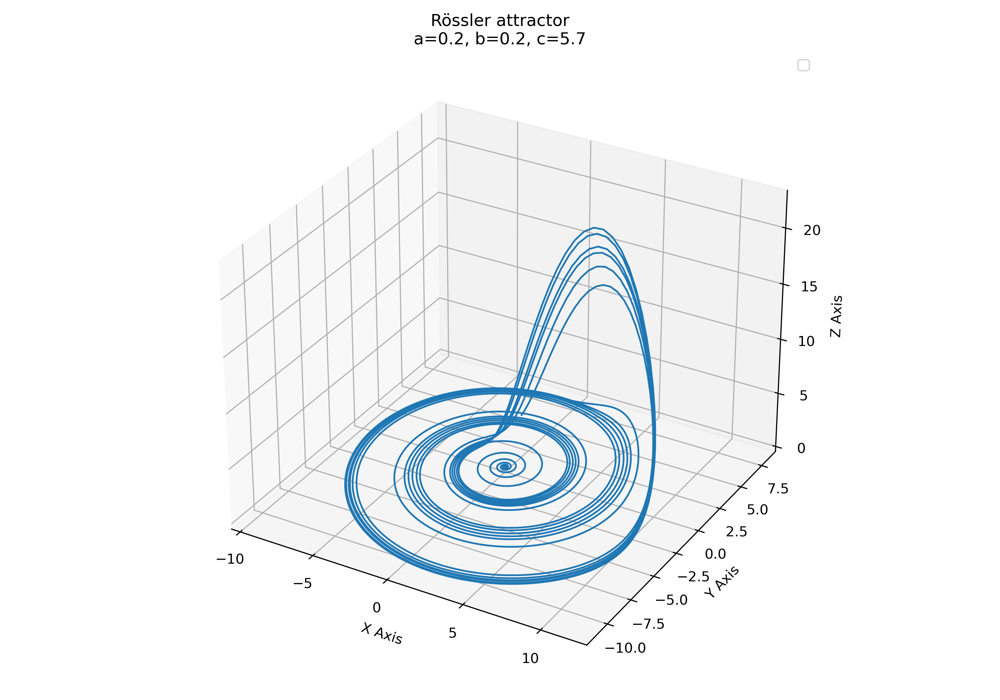

# Rössler attractor 

Just a simple Python code example for simulating the trajectory of the Rössler attractor. Find more information in these blog post

* [The Rössler attractor](https://www.fabriziomusacchio.com/blog/2024-03-10-roessler_attractor/)
* [Nullclines and fixed points of the Rössler attractor](https://www.fabriziomusacchio.com/blog/2024-03-19-roesler_attractor_nullcines_and_fixed_points/)

For reproducibility:

```powershell
conda create -n attractor_networks -y python=3.11
conda activate attractor_networks
conda install mamba -y
mamba install -y numpy matplotlib scikit-learn ipykernel
```


